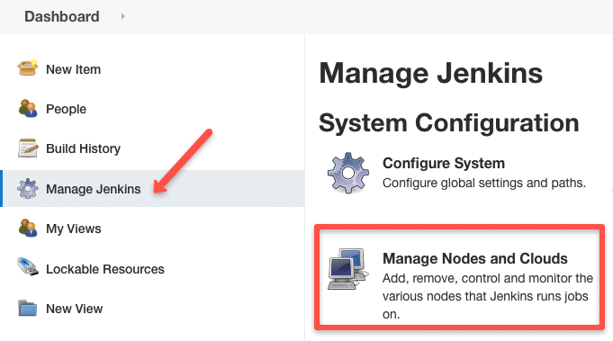
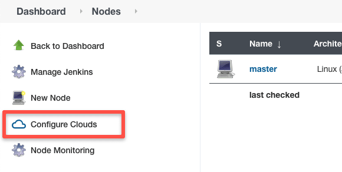
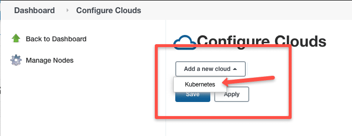
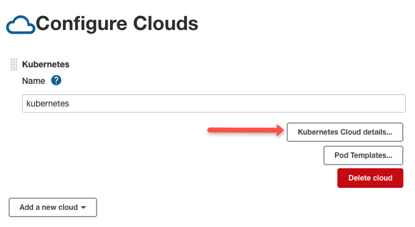
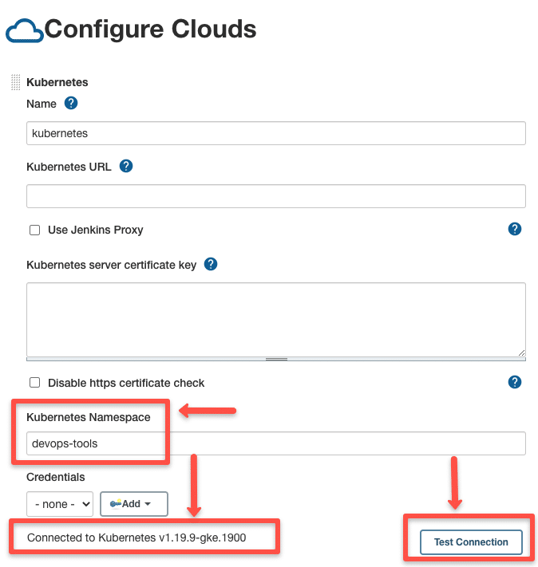
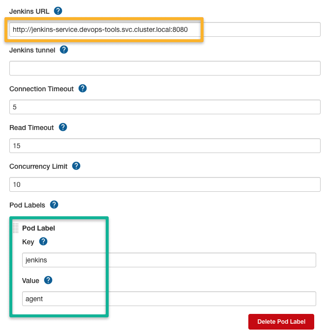
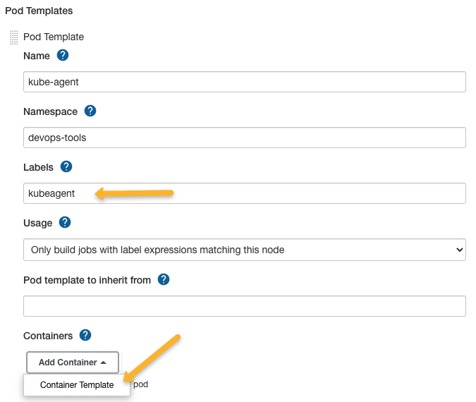
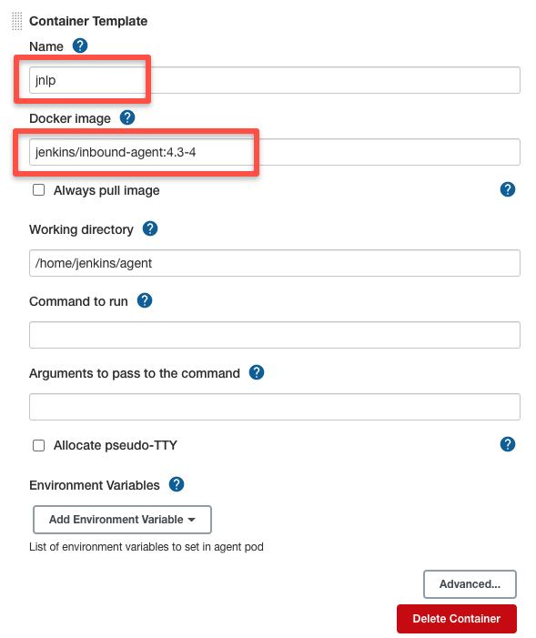
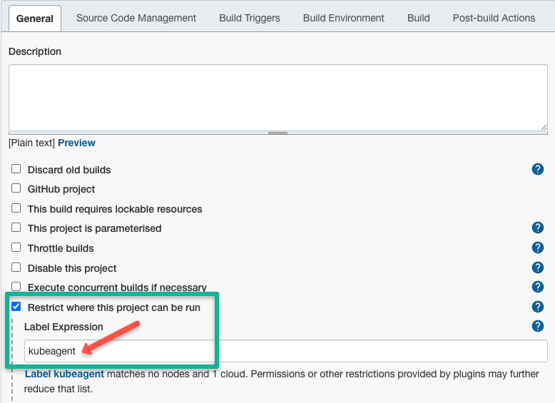

# Running Jenkins

1. This tutorial uses the Storage Class described in the folder `../hostpath-storage`. You must deploy it before continue.

2. Run the commands below following the described ordering
```
kubectl apply -f namespace.yaml
kubectl apply -f volume.yaml
kubectl apply -f serviceAccount.yaml
kubectl apply -f service.yaml
kubectl apply -f deployment.yaml
```

3. Port-forward the service to localhost

```
kubectl port-forward service/jenkins-service 8080:8080 -n devops-tools
```

4. Access the url `localhost:8080` and install the Jenkins. To obtain the key in the first usage, you could look to the pod logs, as shown below. Install the recommended plugins.

```
kubectl logs pod/jenkins-69498c5675-mxn9h -n devops-tools
```

## How to run the Jenkins agent in a k8s pod

Install the plugin called `kubernetes` inside Jenkins. Follow this tutorial to connect the Jenkins and the k8s API.










```
http://jenkins-service.devops-tools.svc.cluster.local:8080
```




```
# Don't forget to remove "sleep" and "999999" values
```





```
http://jenkins-service.devops-tools.svc.cluster.local:8080
```